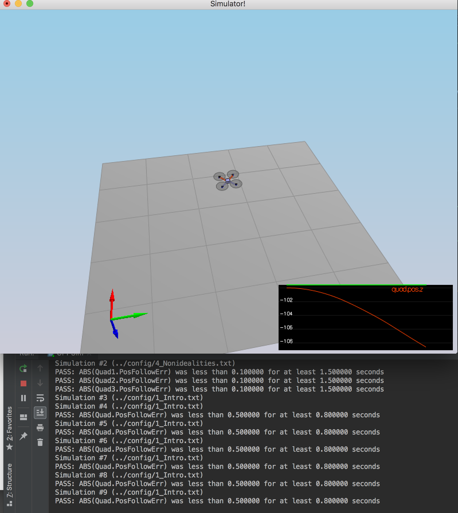
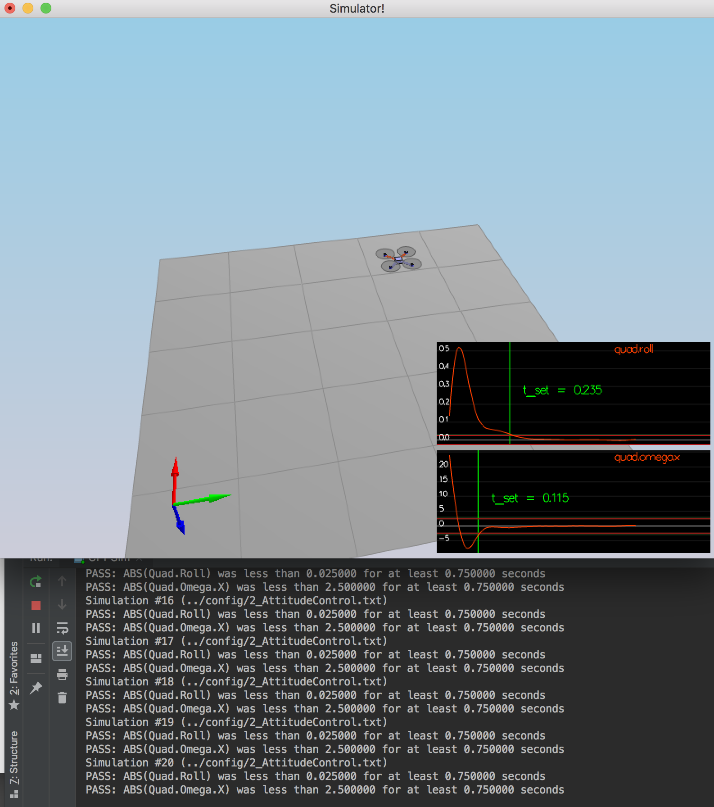
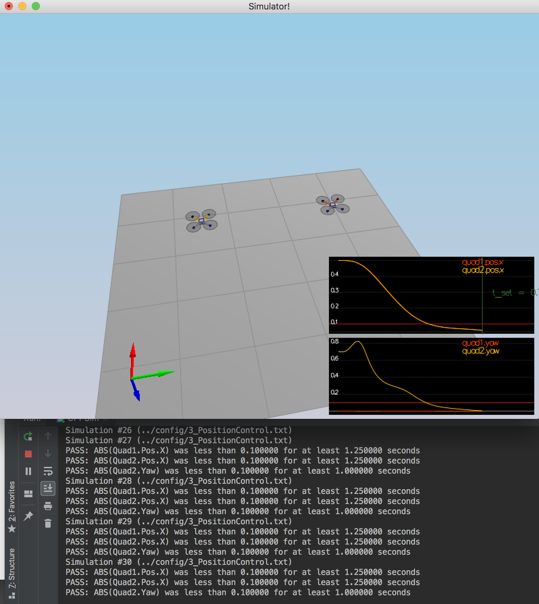
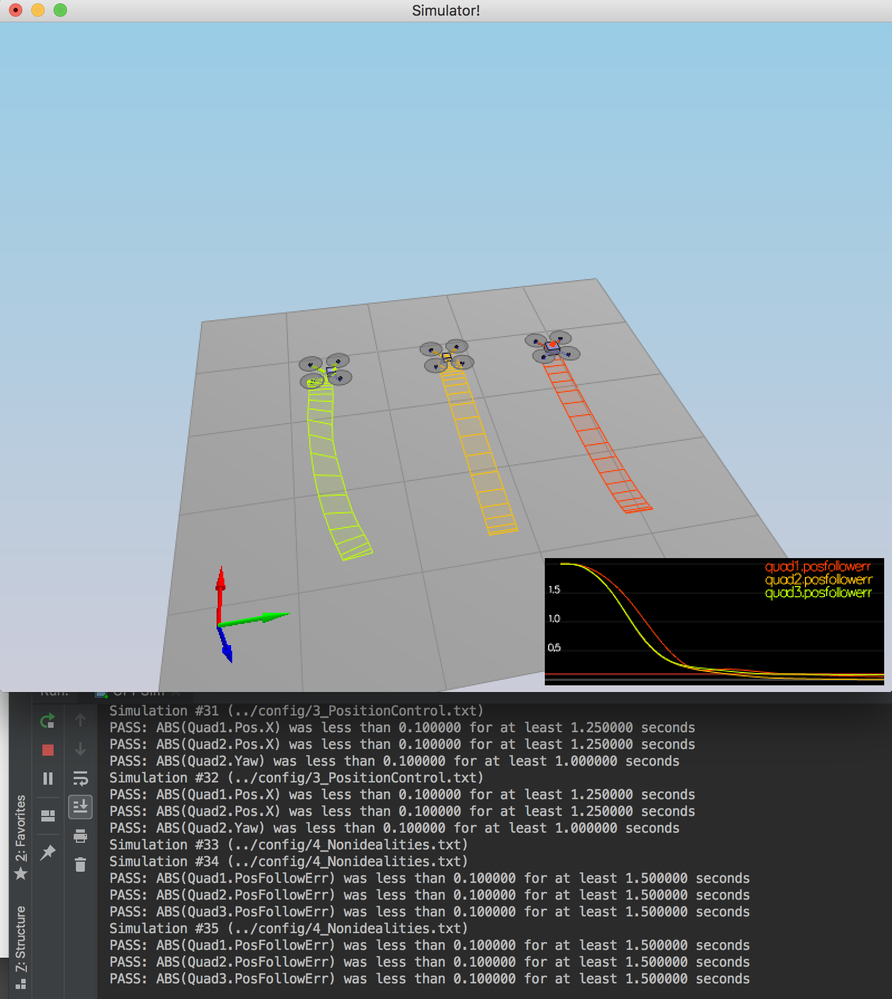

## Project: Building a Controller
---

### Writeup / README

#### 1. Provide a Writeup / README that includes all the rubric points and how you addressed each one.  You can submit your writeup as markdown or pdf.  

You're reading it! Below I describe how I addressed each rubric point and where in my code each point is handled.

### Implement Controller

#### 1. Testing it Out (scenario 1)

The mass parameter was set to `0.5` which made the vehicle more balanced in all following scenarious.

#### 2. Body rate and roll/pitch control (scenario 2)

Implemented functions `GenerateMotorCommands()`, `BodyRateControl()` (p controller) and `RollPitchControl()` (p controller). Tuned `kpPQR` and `kpBank`.

The metric PASS.

#### 3. Position/velocity and yaw angle control (scenario 3)

Implemented functions `LateralPositionControl()`, `AltitudeControl()` (PD-controller) and `YawControl()`. Tuned parameters `kpPosXY`, `kpPosZ`, `kpVelXY`, `kpVelZ`, `kpYaw` and `kpPQR`

The metrics PASS.

#### 4. Non-idealities and robustness (scenario 4)

Implemented `AltitudeControl()`. All three quads are able to successfully move one meter forward.

#### 5. Tracking trajectories

Got a partial failure here. The yellow drone follows the trajectory although not precisely. The red one completely loses its path and flys away. Since this scenario does not appear to be grated and all the previous ones were successful, I've decided to not spend a lot of time on this.