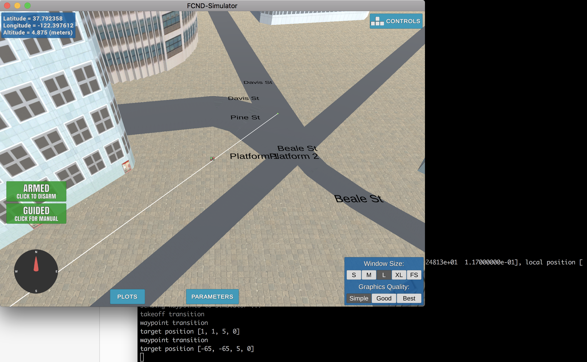
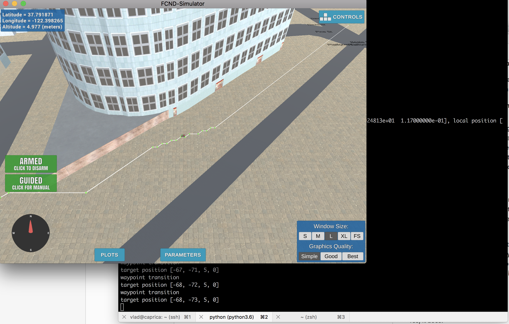
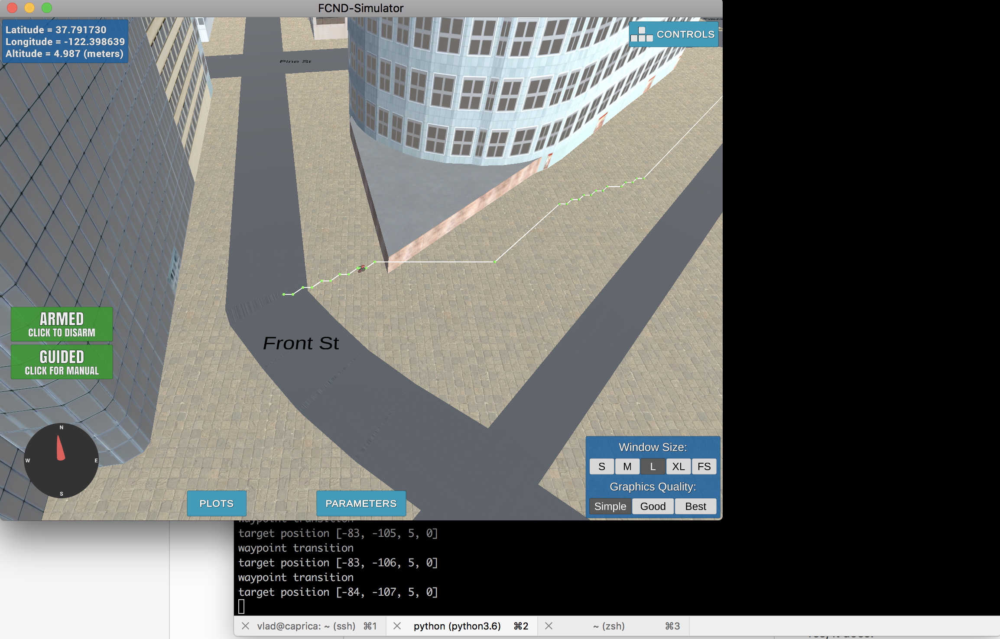
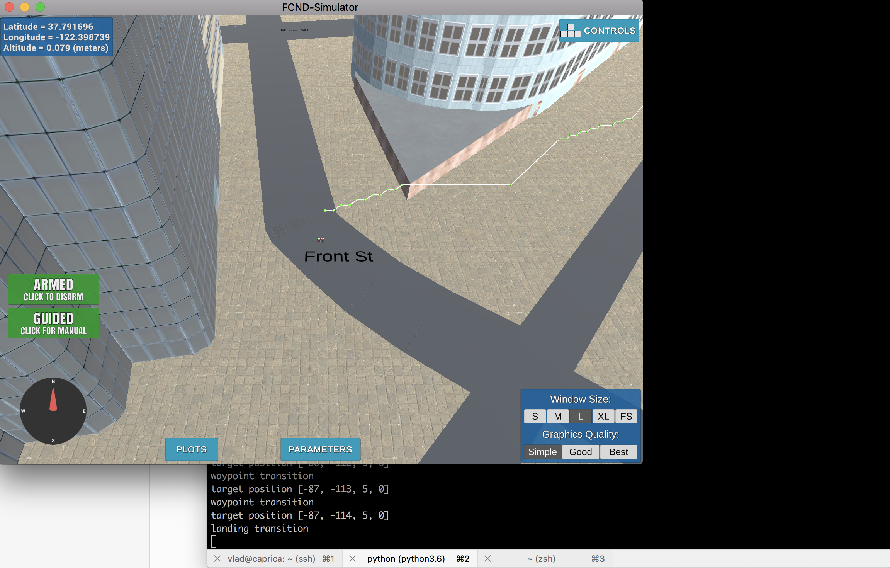

## Project: 3D Motion Planning
---

# Required Steps for a Passing Submission:
1. Load the 2.5D map in the colliders.csv file describing the environment.
2. Discretize the environment into a grid or graph representation.
3. Define the start and goal locations.
4. Perform a search using A* or other search algorithm.
5. Use a collinearity test or ray tracing method (like Bresenham) to remove unnecessary waypoints.
6. Return waypoints in local ECEF coordinates (format for `self.all_waypoints` is [N, E, altitude, heading], where the drone’s start location corresponds to [0, 0, 0, 0].
7. Write it up.
8. Congratulations!  Your Done!

## [Rubric](https://review.udacity.com/#!/rubrics/1534/view) Points
### Here I will consider the rubric points individually and describe how I addressed each point in my implementation.  

---
### Writeup / README

#### 1. Provide a Writeup / README that includes all the rubric points and how you addressed each one.  You can submit your writeup as markdown or pdf.  

You're reading it! Below I describe how I addressed each rubric point and where in my code each point is handled.

### Explain the Starter Code

#### 1. Explain the functionality of what's provided in `motion_planning.py` and `planning_utils.py`

The `planning_utils.py` file provides functions required to implement full path planning process. The most important method in the file is `a_star()` which returns a path from starting point to the goal. It implements A* algorithm which is nog greedy like other planning methods and uses a heuristic to find the shortest path.

The `motion_planning.py` file impelments a finite state machine code similar to `backyard_flyer.py`. The only difference is the additional `PLANNING` state which automatically generates preiviously hard-coded way points. The state comes between `ARMING` and `TAKEOFF` and is implemented in `plan_path()` function which calculates the necessary waypoints for the drone to make it to the final destination. The function does the following:
* the `colliders.csv` file describing the obstacle map is loaded
* a grid is generated via `create_grid()` from `planning_utils.py` file
* pre-defined start and goal points are set in the grid coordinates
* `a_star()` is called to find the best path to the goal
* the path is converted to waypoints which are passed to the simulator 

### Implementing Your Path Planning Algorithm

#### 1. Set your global home position

I read the fist line of `colliders.csv` where the position is specified, then split the line into two parts,`lat0` and `lon0`, remove the substrings with the field names and convert the numbers to float. The I call `self.set_home_position` to save the position

#### 2. Set your current local position

The current local position is calculated from the current global position in `self.global_position` and global home position `self.global_home` set on the previous step using the `global_to_local()` method.

#### 3. Set grid start position from local position

I already have latitude and longitude to get this, so I just do it.

#### 4. Set grid goal position from geodetic coords

I use the same approach as with start position here. Again, we have all the data to calculate this in `self.target_position`

I've modified `MotionPlanning` class to accept `target_position` as constructor parameters so I can set them via command line arguments for `motion_planning.py`.

#### 5. Modify A* to include diagonal motion (or replace A* altogether)

I made the minimum required change to A* implementation to include the diagonal motions on the grid. For that, I modified the code in `planning_utils.py` where `Action` enum and `valid_actions()` method were extended for 4 additional diagonal movements with the cost of `np.sqrt(2)`.

#### 6. Cull waypoints 
For this step you can use a collinearity test or ray tracing method like Bresenham. The idea is simply to prune your path of unnecessary waypoints. Explain the code you used to accomplish this step.

I used collinearity test from the lectures here: if three three consecutive path points have a very small deviation, the middle point can be removed. The deviation is calculated using `np.linalg.det()` and the limit for it is `0.00001`.

### Execute the flight
#### Does it work?
Yes, it does!

